# JavaScript30 Day 1 - Drum-Kit

## Introduction

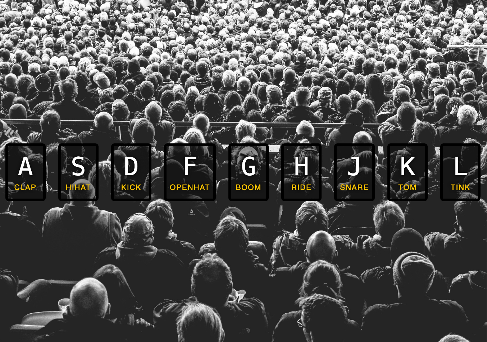

### Main goals

When you hit the corresponding key on your keyboard, it’s going to do two things:

1. It’s going to play the sound that’s associated with that key

2. Where it pops the button up to be a little bit bigger than we want. And then also, it apply that yellow border and that little background there.

### Demo: [Click me](https://richiea1y.github.io/JavaScript30/Day1-JavaScript-Drum-Kit/)

## ✏️ Notes

### 1. You can custom data in HTML attributes prefixed with data- for whatever you want

- So, where if we want to make up something like a key, you have to put it behind a data-{…} something.

- ([🔗](https://stackoverflow.com/questions/1735230/can-i-add-a-custom-attribute-to-an-html-tag/1735268#1735268)) You can add custom attributes to your elements at will. But that will make your document invalid.

- In HTML 5 you will have the opportunity to use [custom data attributes prefixed with data-](https://html.spec.whatwg.org/#embedding-custom-non-visible-data-with-the-data-*-attributes).

### 2. Use same key-code (classes) attributes associate with audio element.

- After you add `addEventListener` you can see the `keycode` attribute in the console when you `console.log` event.

  ```JavaScript
  window.addEventListener('keydown', function (e) {
    console.log(e);
  })
  ```

  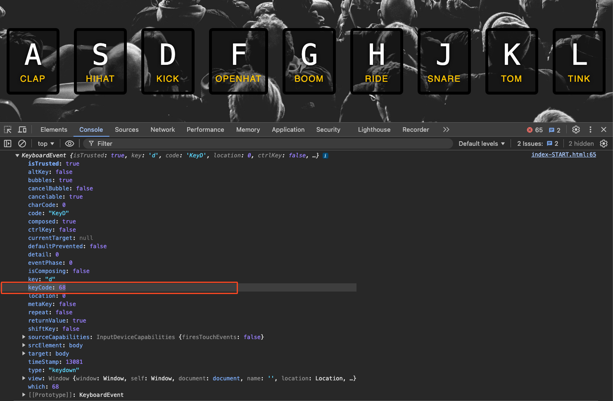

### 3. Use ES6 Template String for dynamic value of HTML attribute when use querySelector

- This scenario the value of attribute will be fix in 65

  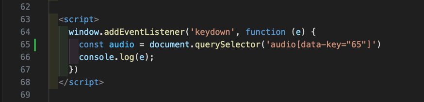

- But you can use ES6 Template String at the value of attribute

  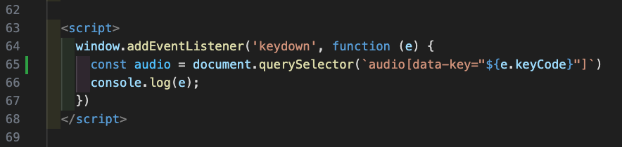

### 4. By setting currentTime to 0, the code ensures that every time a key is pressed, the corresponding audio will play from the start, rather than resuming from where it last stopped.

- `play()` method won’t play again if it’s already playing with that.

  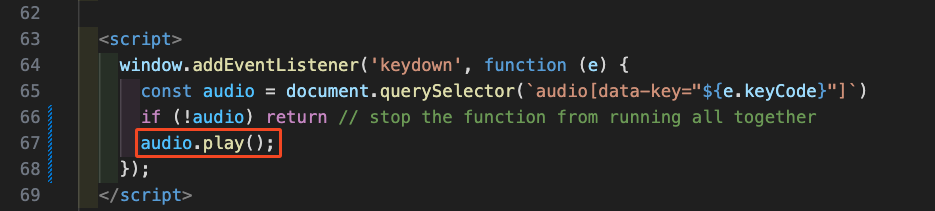

- If we want that rewind it to the start of the element, so that if you hit it in succession over and over again. We can assign `currentTime` property of the `audio` object equal 0.

  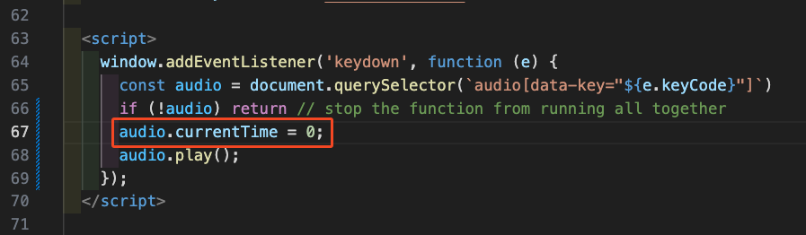

  1. `audio.currentTime = 0;` sets the current playback time of the audio to 0 seconds, effectively resetting it to the beginning.

  2. `currentTime` is a standard property of HTML5 audio and video elements. It represents the current playback position of the media in seconds.

- By setting `currentTime` to 0, the code ensures that every time a key is pressed, the corresponding audio will play from the start, rather than resuming from where it last stopped.

### 5. When you have an array of elements, you cannot listen on all of them. (It’s a Node List - not an array)

- Let’s say we want document.querySelectorAll('.key'). That give us an array of every single element that is matched.

  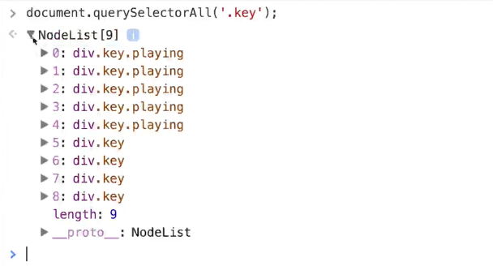

- Then we want to listen for an event called transition end on each one. When you have an array of elements, you cannot listen on all of them. You must explicitly loop over every singly element and attach an event listener.

  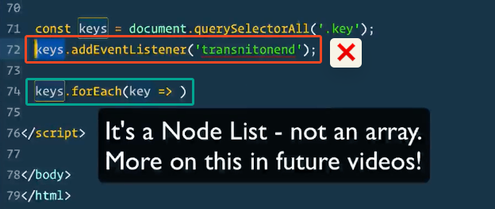

### 6. TransitionEvent (MDN): We also have a events in JS that will say “I didn’t get clicked but i was transitioned.”

- We can listen on each key for when the transition and event happens.

  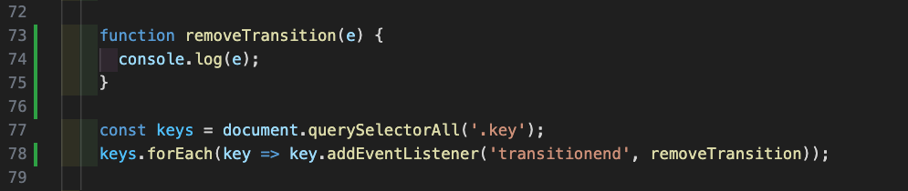

- When we’re going to press A. **Chrome DevTools** _indicates 6 transition end events_ for that one little fade in where it got a little bigger.

  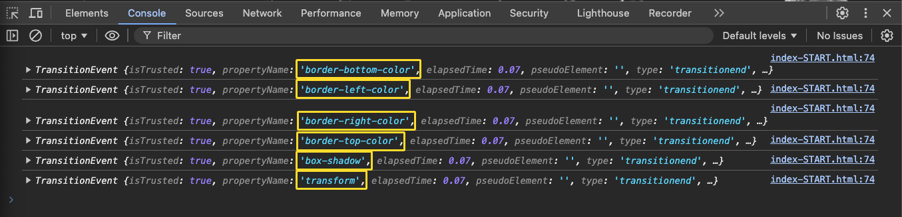

- We only want to remove ‘transform’ of TransitionEvents when it’s end. So we filter out all TransitionEvents whose property is not 'transform.

  ```JavaScript
  if (e.propertyName !== 'transform') return;
  // skip it if it's not a transform
  ```

  ### 7. The <kbd> HTML element = represents a span of inline text denoting textual user input from a keyboard, voice input, or any other text entry device ([MDN](https://developer.mozilla.org/en-US/docs/Web/HTML/Element/kbd))

  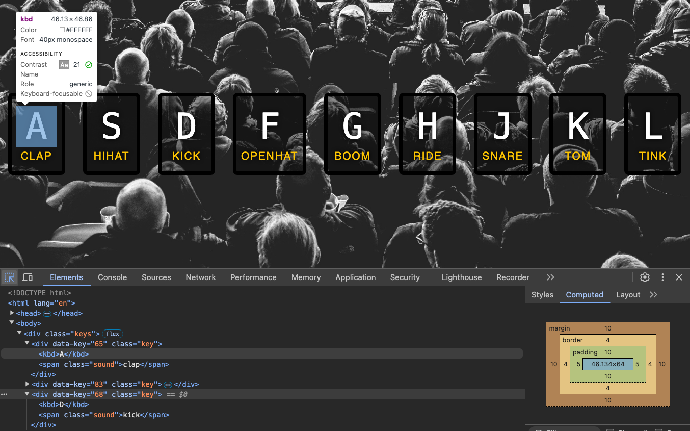
