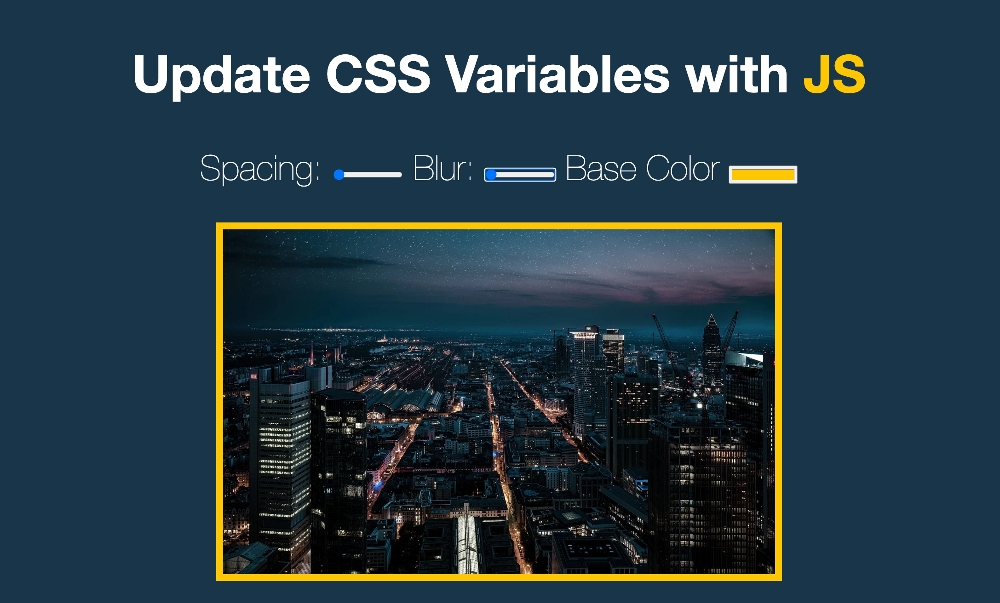
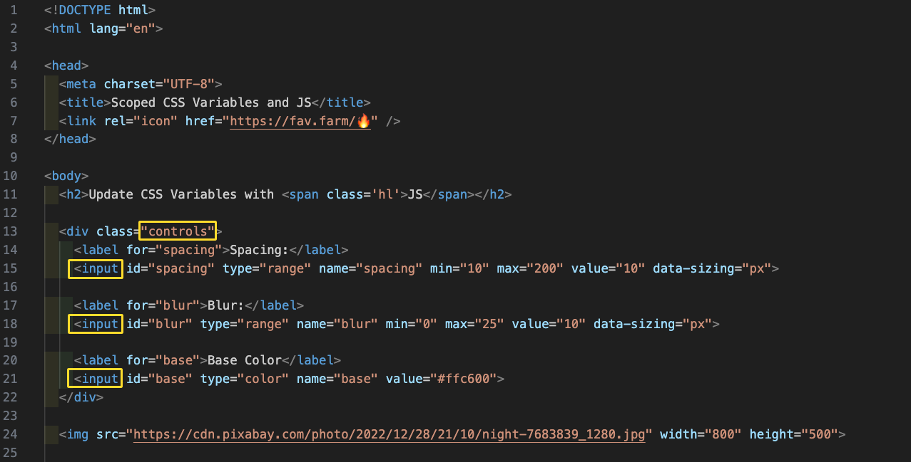
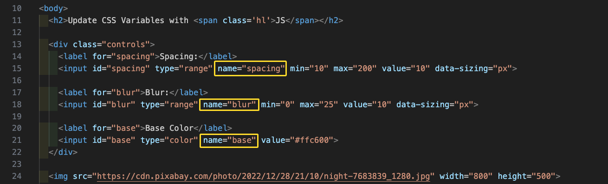
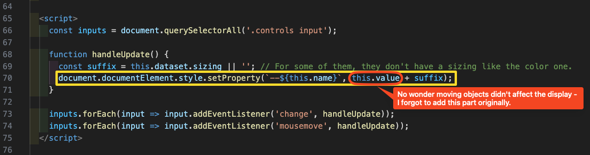

# JavaScript30 Day 3 - Playing with CSS Variables and JS

## Introduction



### Main goals

- We have three variables: spacing, blur, and base color. Whenever you change one of these, it instantly updates everywhere that variable is used on the page.

- Updates CSS variables using JavaScript to dynamically change the appearance of an image.

### Demo: [Click me](https://richiea1y.github.io/JavaScript30/Day3-Playing-with-CSS-Variables-and-JS/)

## ✏️ Notes

### 1. CSS variable can be update with JavaScript = when you update a variable in CSS, everywhere on the page that variable referenced will update itself.

- CSS variable can be update with JavaScript = when you update a variable in CSS, everywhere on the page that variable referenced will update itself.

  - With SAS, you define them at compile time and then it gets compiled and you cannot change it.

  - CSS variables work by declaring them on an element, typically the root element.

### 2. Using JavaScript to update those variables to dynamically change the appearance of an image

#### a. First need to select all three of these inputs so that when they change we can then update the CSS variable.

- (Descendant Rule - [後代選取器]) Using `.controls input` ensures that you're only selecting the inputs within the `.controls` container.

  ```JavaScript
  const inputs = document.querySelectorAll('.controls input');
  ```

  

#### b. Second use the `.forEach()` method to iterate through the list of event nodes. Create a function that logs the changed value to the console.

```JavaScript
function handleUpdate() {
  console.log(this.value);
}

inputs.forEach((input) => input.addEventListener('change', handleUpdate));
```

1. But when you drag it around it doesn’t actually a trigger change.

2. We can also listen for the `mousemove` update which when you move over. It looks it’s going to trigger every single time.
   ```JavaScript
   inputs.forEach((input) => input.addEventListener('mousemove', handleUpdate));
   ```

#### c. Go getting the values out of it.

1. dateset is an object that will contain all the data attributes from that specific element.In this case just

   - dateset is an object that will contain all the data attributes from that specific element.

     "The dataset object:

     - Automatically contains all data attributes of an element, **_it will just take everything that has data- on that element and put it into a nice tidy little object for you._**

     - Is readily available for each element without manual selection

     - In this case, holds sizing information

     - Can be accessed directly within event handling functions"

2. sizing. dataset is just an object that all ready. You don’t have to select it.

#### d. Update the actual variable = select our entire document which is our root here.




